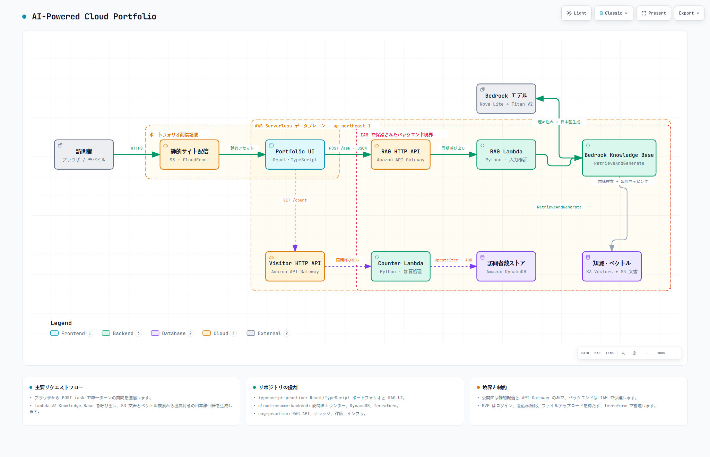

# Cloud Resume Challenge — Backend

日本語 | [English](./README.en.md)

Cloud Resume の訪問者数を記録する AWS サーバーレス API です。API Gateway、Python Lambda、DynamoDB を Terraform で構築します。

**Demo:** https://dyp8879eswsdu.cloudfront.net/

## システム全体像

[](docs/architecture/AI-Powered-Cloud-Portfolio.html)

画像をクリックするとインタラクティブ版を開けます。このリポジトリは図の訪問者カウンター経路を担当します。

```text
Portfolio UI
  → GET /count
  → Amazon API Gateway
  → AWS Lambda (Python)
  → DynamoDB UpdateItem (ADD)
  → { "views": number }
```

## 設計ポイント

- DynamoDB の `UpdateItem` と `ADD` を使ったアトミックなカウント更新
- Lambda から DynamoDB への権限を IAM ポリシーで限定
- API Gateway から Lambda を同期呼び出し
- ブラウザ向け CORS レスポンス
- Python 3.13 ランタイム
- Terraform による再現可能なインフラ定義

## 主なファイル

```text
lambda_function.py        訪問数を更新して返す Lambda ハンドラー
test_lambda_function.py   Lambda の単体テスト
main.tf                   DynamoDB、IAM、Lambda、API Gateway
```

## API レスポンス

```json
{
  "views": 123
}
```

## テスト

```powershell
python -m pytest -p no:cacheprovider
```

## Terraform

```powershell
terraform fmt -check
terraform init
terraform validate
terraform plan
```

Terraform state、生成された ZIP、AWS 認証情報はコミット対象外です。本番環境では GitHub OIDC または安全なシークレット管理を利用します。

## 関連リポジトリ

- [typescript-practice](https://github.com/LUOLIFAN-CHUO/typescript-practice) — カウンターを表示する React/TypeScript 履歴書サイト
- [rag-practice](https://github.com/LUOLIFAN-CHUO/rag-practice) — 履歴書 RAG アシスタント

## アーキテクチャ成果物

- [インタラクティブ HTML](docs/architecture/AI-Powered-Cloud-Portfolio.html)
- [Archify ソース仕様](docs/architecture/AI-Powered-Cloud-Portfolio.architecture.json)
- [PNG プレビュー](docs/architecture/AI-Powered-Cloud-Portfolio.png)
